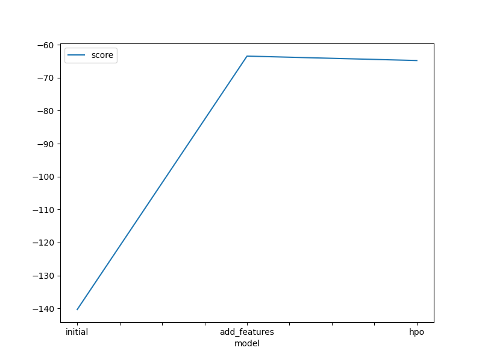
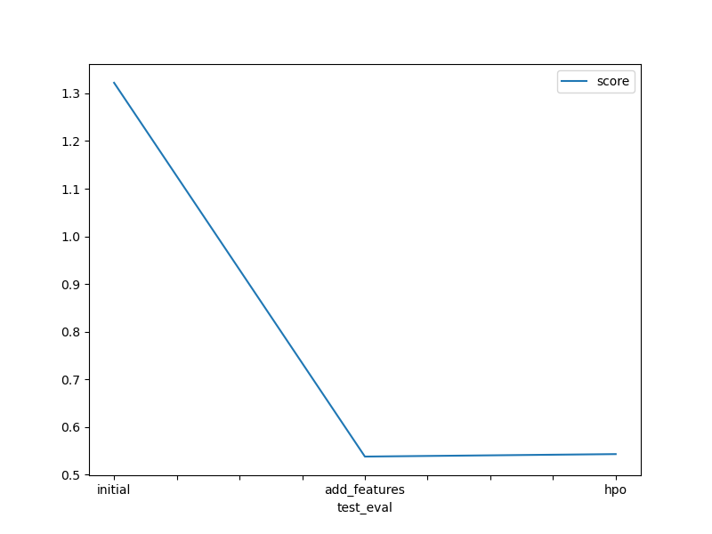

# Report: Predict Bike Sharing Demand with AutoGluon Solution
#### DIVYANSHI JOSHI

## Initial Training
### What did you realize when you tried to submit your predictions? What changes were needed to the output of the predictor to submit your results?
When I initially tried to submit my predictions, I first got errors as I forgot to drop the features casual and registered while training the model as they were not included in the test.csv dataset. I also realized that my model was predicting negative values for the bike "count". Since the number of bikes rented can't be negative, I had to modify the output by setting all negative predictions to 0 before submitting the results.

### What was the top ranked model that performed?
The top ranked model was the WeightedEnsemble_L3 model.

## Exploratory data analysis and feature creation
### What did the exploratory analysis find and how did you add additional features?
The exploratory analysis of the data proved that there are clear daily and seasonal cyclical patterns in bike sharing demand. To help the model capture these patterns, I added new feature by extracting the hour feature from the 'datetime' column.

### How much better did your model preform after adding additional features and why do you think that is?
After adding the new features, the model's performance improved significantly. Adding the 'hour' feature improved the learning of the model which produced better results.

## Hyper parameter tuning
### How much better did your model preform after trying different hyper parameters?
Tuning the hyperparameters gave a moderate improvement, reducing the RMSE by about 2-3%. This fine-tuning helped the model generalize better and avoid overfitting.

### If you were given more time with this dataset, where do you think you would spend more time?
If I had more time, I would focus on feature engineering, especially extracting more features like day, month and year as well from the 'datetime' column. I would also try ensemble methods and stacking different models for even better performance.

### Create a table with the models you ran, the hyperparameters modified, and the kaggle score.
|model|hpo1|hpo2|hpo3|score|
|--|--|--|--|--|
|initial|-140.341672| -141.029454 | -141.188095| 1.32230 |
|add_features|-63.444587| -63.734184| -64.012172 | 0.53800 |
|hpo|-64.780999|-65.113773|-65.253575|0.54318|

### Create a line plot showing the top model score for the three (or more) training runs during the project.

### Create a line plot showing the top kaggle score for the three (or more) prediction submissions during the project.

## Summary
This was an interesting project to do for learning about AutoGluon for time-series forecasting. Starting with a basic model gave a me a reasonable baseline, after which adding relevant features and tuning the hyperparameters led to better results. Through this project, I was able to learn the importance of feature engineering and model tuning which significantly impact the accuracy of a model.

